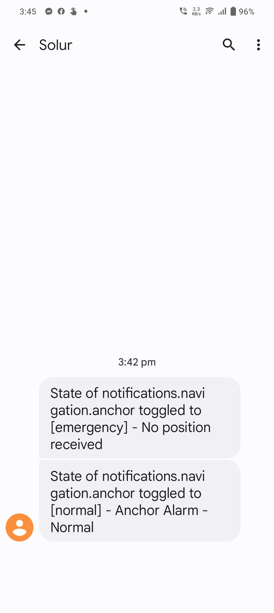
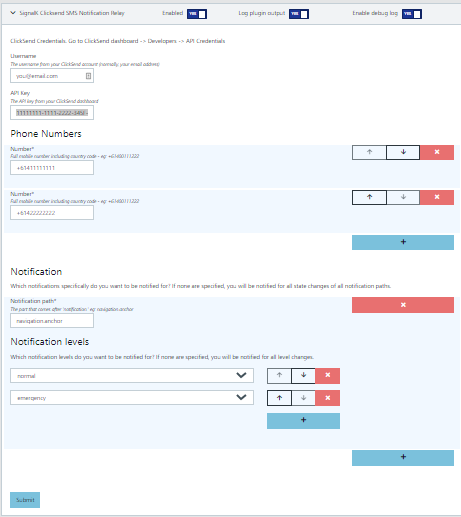

# signalk-clicksend-notification-relay

Signalk-node-server plugin that pushes listens for change of state in SignalK notifications and sends the updates via SMS gateway ClickSend https://www.clicksend.com. Particularly useful to keep an eye on your boat when you are not aboard. The author created this plugin to enable remote notification of anchor dragging emergencies.

# About ClickSend

ClickSend (no affiliation with the author or this software), is a company that provides messaging gateway as a service. This plugin uses it to forward your notifications to your mobile phone via SMS message.
ClickSend is a commercial service and you will need to pay a fee. The pre-paid option is quite suitable for this purpose with long expiry terms. You can get started for free however, you will be given a little credit for testing when you sign up.

# Installation

First you'll  want to make sure you have the latest and greatest [signalk-server-node](https://github.com/SignalK/signalk-server-node) installed. Please see instructions there for initial install.
Next install the node server plugins that you want. Go to <http://localhost:3000/appstore> and install:

signalk-clicksend-notification-relay

# Configuration

Go to your ClickSend dashboard, navigate to `Developer` -> `Api Credentials` and take note of your username and API key. If no key is available, you can create one.

Navigate to http://localhost:3000/admin/#/serverConfiguration/plugins/signalk-clicksend-notification-relay, and enter your ClickSend username and API key. Then add the phone numbers at which you would like to receive notifcation SMS.

You can leave the Notifications section empty if you want an SMS for all notification.* paths and all states (this can get expensive). Ideally, you should configure which notification paths you are interested in and which levels... For example notifications.navigation.anchor normal and emergency.

That's it.
